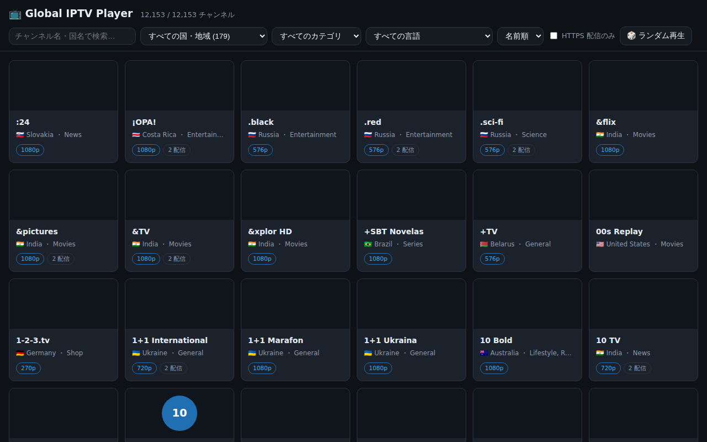
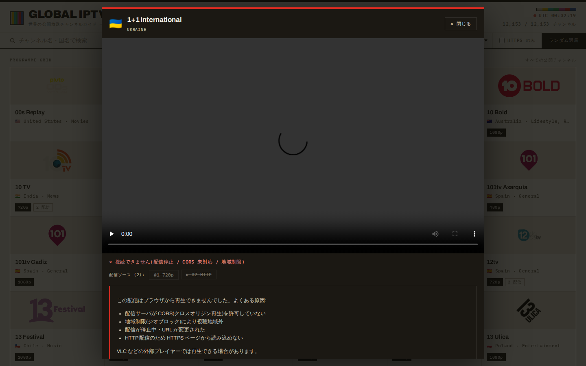
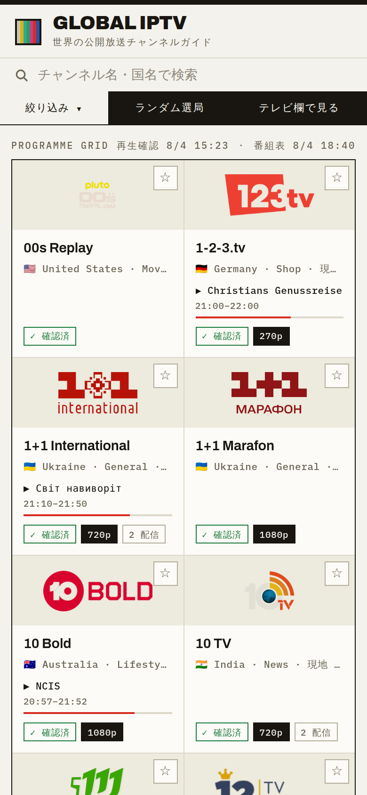

# Global IPTV — 世界の放送をブラウザで

[iptv-org/iptv](https://github.com/iptv-org/iptv) が公開している全世界の IPTV チャンネル(約 1 万局)をブラウザからストリーミング再生できる静的 Web ページです。ビルド不要・サーバサイド不要で、GitHub Pages などの静的ホスティングにそのまま配置できます。



## デザイン

「国際番組表」をコンセプトに、新聞のテレビ欄と放送局のマスター管制室を参照した
エディトリアルデザインを採用しています。

- **紙面のような配色** — 温かみのある紙色の地に墨色の罫線・文字、アクセントは放送レッドのみ
- **表組みグリッド** — 1px のヘアライン罫で区切られた印刷物のテレビ欄風レイアウト。
  ロゴは乗算ブレンドで紙面に馴染ませる
- **タイポグラフィ** — 見出し・チャンネル名に [Archivo](https://fonts.google.com/specimen/Archivo)(可変フォント・同梱)、
  時刻・国名・画質などの技術メタ情報に [IBM Plex Mono](https://fonts.google.com/specimen/IBM+Plex+Mono)(同梱)、
  日本語はシステムフォント
- **放送のディテール** — マストヘッドの SMPTE カラーバー、UTC 時計、LIVE インジケータ、
  チューニング風ローディング表示。プレイヤーは黒スタージ + 赤いオンエアバーの管制室風

| プレイヤー | モバイル |
|---|---|
|  |  |

## 機能

- **全世界のチャンネル一覧** — [iptv-org API](https://github.com/iptv-org/api) からチャンネル・ストリーム・ロゴ・国・カテゴリ・言語データを取得して結合(約 1 万 2 千エントリ)
- **検索・絞り込み** — チャンネル名(別名・ネットワーク名を含む)のテキスト検索、国・カテゴリ・言語・HTTPS 配信のみでの絞り込み、名前順 / 国順ソート
- **ストリーミング再生** — [hls.js](https://github.com/video-dev/hls.js) による HLS 再生(Safari はネイティブ HLS にフォールバック)。DASH (.mpd) は dash.js を遅延読み込み、.mp4 / .webm はプログレッシブ再生
- **自動フォールバック** — 複数ソースを持つチャンネルは、失敗時に次のソースを自動で試行
- **エラー時の代替手段** — 全ソース失敗時はストリーム URL のコピー / .m3u ダウンロード(VLC などで再生)/ 公式サイトへのリンクを提示
- **1 万件超への対応** — 60 件ずつの遅延描画(IntersectionObserver)+ ロゴの遅延読み込み
- **ディープリンク** — `#play=<チャンネルID>` で特定チャンネルを直接開ける
- **NSFW 除外** — `is_nsfw` フラグ付きチャンネルは常に除外(データソース自体もブロックリスト適用済み)

## 使い方

### ローカルで起動

`fetch` を使うため `file://` では動きません。任意の静的サーバで配信してください。

```bash
npx http-server -p 8080 .
# → http://127.0.0.1:8080 を開く
```

### GitHub Pages で公開

デプロイ用ワークフロー(`.github/workflows/deploy-pages.yml`)を同梱しています。
初回のみ、リポジトリの **Settings → Pages → Build and deployment → Source** を
**GitHub Actions** に設定してください(Pages の新規有効化は Actions のトークン権限では
行えないため、この 1 クリックだけ手動が必要です)。以後はデフォルトブランチへの
プッシュごとに自動デプロイされます。手動実行は Actions タブの
「Deploy to GitHub Pages」→ Run workflow からも可能です。

> **プライベートリポジトリの場合**: GitHub Pages は Free プランではパブリック
> リポジトリのみ利用できます。プライベートのまま公開するには Pro 以上のプランが
> 必要です(公開されたサイト自体は誰でも閲覧可能になります)。

> **注意**: HTTPS ページとして公開すると、`http://` のストリーム(全体の約 2 割)は
> ブラウザの混在コンテンツ制限により再生できません。アプリはこれを検出して
> 「HTTP のみ」バッジ表示・「HTTPS 配信のみ」フィルタの自動有効化で対処します。

## アーキテクチャ

| ファイル | 役割 |
|---|---|
| `index.html` | ページ本体(hls.js は SRI 付き CDN 読み込み) |
| `assets/js/data.js` | iptv-org API の取得と結合(streams → channels / feeds / logos / countries / categories / languages) |
| `assets/js/player.js` | プレイヤーモーダル(hls.js / ネイティブ HLS / dash.js / プログレッシブ、自動フォールバック) |
| `assets/js/app.js` | UI 状態管理・検索・絞り込み・遅延描画 |
| `assets/css/style.css` | エディトリアル UI(番組表グリッド・プレイヤー管制室スタイル) |
| `assets/fonts/` | 同梱 Web フォント(Archivo 可変・IBM Plex Mono、latin サブセット、OFL) |

### データ結合の要点(iptv-org API 仕様)

- `channels.json` にはロゴ・言語フィールドが**無い**ため、`logos.json`(チャンネルごとに最良の 1 枚を選択)と `feeds.json`(言語はフィードに紐づく)を結合
- `feeds` の `id` はチャンネル内でのみ一意 → `(channel, id)` の複合キーで参照
- ストリームの約 1 割は `channel: null`(タイトルのみ)→ タイトル単位でグルーピングして表示
- `streams.json` は DMCA / NSFW ブロックリスト適用済み

## ブラウザ再生の制約(既知の制限)

IPTV ストリームの多くはブラウザ再生を想定していないサーバから配信されているため、
**すべてのチャンネルがブラウザで再生できるわけではありません**。主な理由:

1. **CORS 未対応** — hls.js は fetch でセグメントを取得するため、配信サーバが
   `Access-Control-Allow-Origin` を返さないと再生不可(VLC では再生できるのに
   ブラウザでは不可、の主因)
2. **地域制限(ジオブロック)** — 403 などで拒否される
3. **混在コンテンツ** — HTTPS ページから `http://` ストリームは読み込み不可
4. **カスタムヘッダ要求** — `User-Agent` / `Referrer` の指定が必要な配信は
   ブラウザからは送信不可(約 1,200 件)
5. **非対応プロトコル** — rtmp / rtsp などはブラウザ再生不可

このため、失敗時には次ソースへの自動フォールバックと、URL コピー / .m3u
ダウンロードによる外部プレイヤー(VLC など)への導線を用意しています。

## テスト

[Playwright](https://playwright.dev/) による E2E テスト付き。

```bash
npm install
npx playwright install chromium   # ブラウザ未取得の場合のみ
npm test          # ハーメチックテスト(ネットワーク不要・フィクスチャ注入)
npm run test:live # 実 API へのスモークテスト(到達不可なら自動スキップ)
```

- `tests/app.spec.js` — 一覧・検索・絞り込み・ソート・NSFW 除外・ディープリンク
- `tests/player.spec.js` — HLS パイプライン(マニフェスト→セグメント取得)、
  WebM 実再生、自動フォールバック、エラーパネル、URL 分類、DASH フォールバック
- `tests/resilience.spec.js` — 任意エンドポイント欠落時の縮退動作、必須エンドポイント
  失敗 → 再試行の復帰
- `tests/realdata.spec.js` — 実データスナップショット(4 万チャンネル)での
  スケール検証(スナップショット未取得時は自動スキップ。取得方法はファイル冒頭参照)
- `tests/live.spec.js` — 実 API スモークテスト

再生検証は Playwright 同梱 Chromium に H.264 デコーダが含まれない制約を考慮し、
HLS はネットワークパイプラインまで、実デコードは VP8/WebM フィクスチャで検証しています。

## クレジット / ライセンス

- チャンネルデータ: [iptv-org](https://github.com/iptv-org)(パブリックドメイン, [Unlicense](https://github.com/iptv-org/iptv/blob/master/LICENSE))
- 再生: [hls.js](https://github.com/video-dev/hls.js) / [dash.js](https://github.com/Dash-Industry-Forum/dash.js)
- フォント: [Archivo](https://github.com/Omnibus-Type/Archivo) / [IBM Plex Mono](https://github.com/IBM/plex)(いずれも SIL Open Font License 1.1)
- 各ストリームの著作権はそれぞれの放送局・配信者に帰属します。本プロジェクトは
  動画ファイルを一切ホストせず、公開されているストリームへのリンクのみを扱います。
